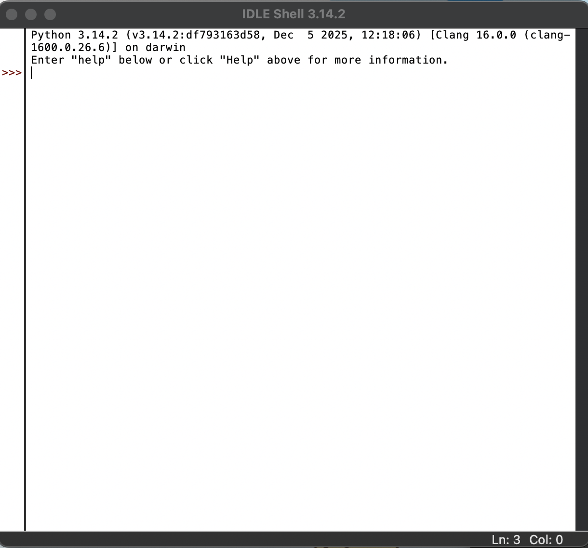
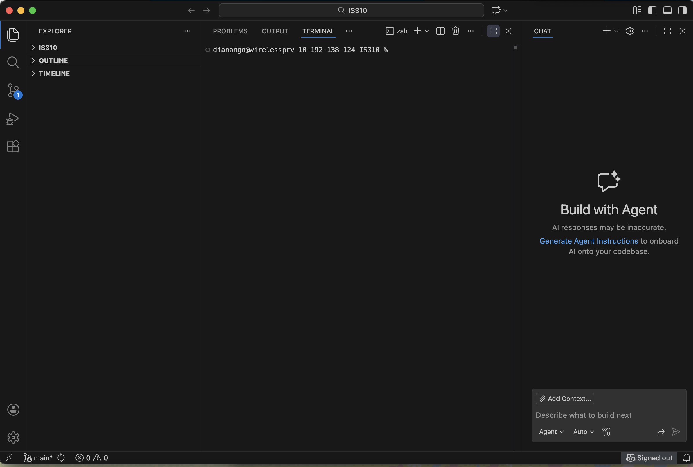

# Init IS310 Homework

## Proof of Installation

1. Python

2. Git

3. VS Code

4. AI Tool/Workflow 

How will you work with AI? What tools if any do you plan to use?

Hypothesis username: dianango25

I plan to use GitHub Codepilot to help explain coding functions.

