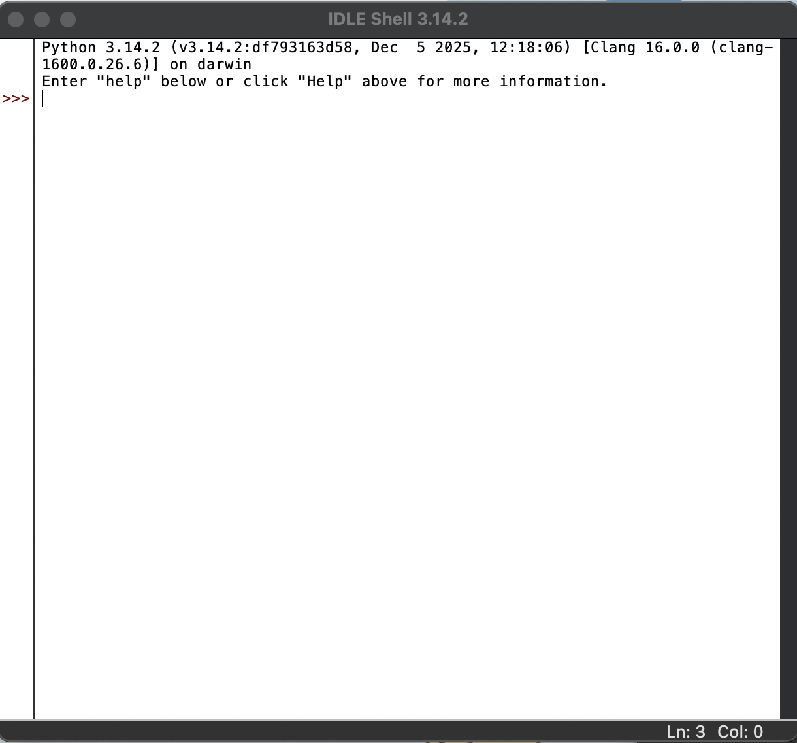
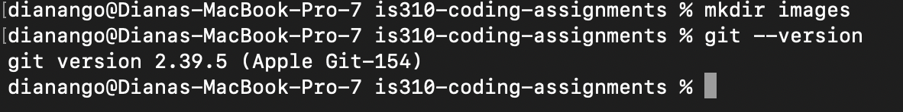
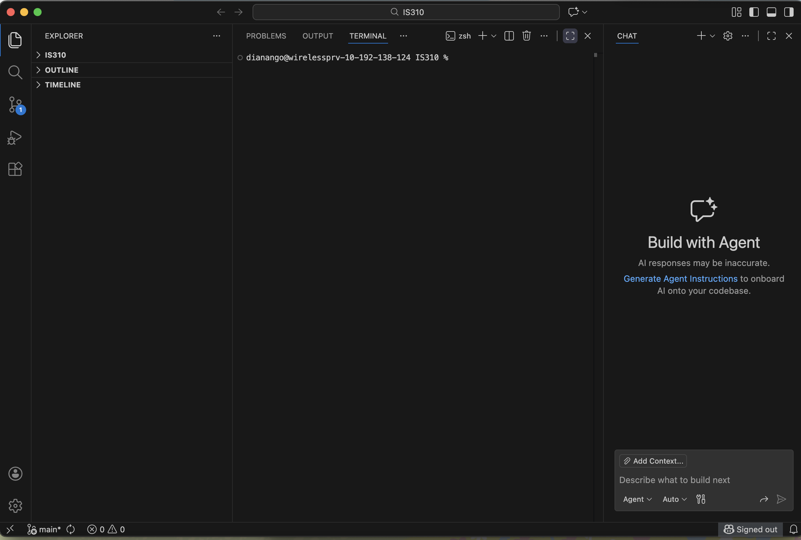
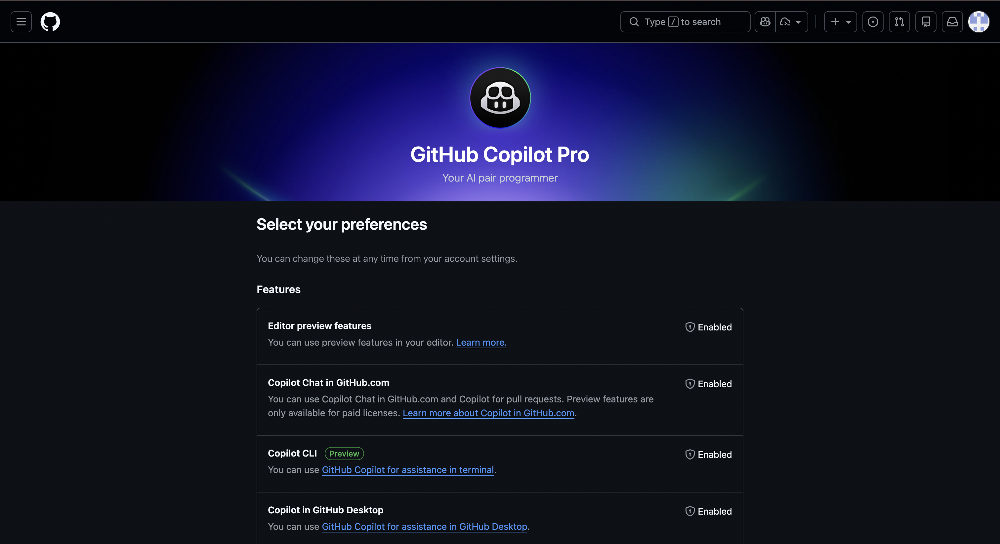

# Init IS310 Homework

## Proof of Installation

1. Python

2. Git

3. VS Code

4. AI Tool/Workflow 

How will you work with AI? What tools if any do you plan to use?

Hypothesis username: dianango25

I plan to use GitHub Codepilot to help explain coding functions. Additionally, I will use ChatGPT to help debug and curate sections of my code, most notably for analyzing sentiment analysis, importing VADER, debugging function logic, and reformatting the CSV file.

