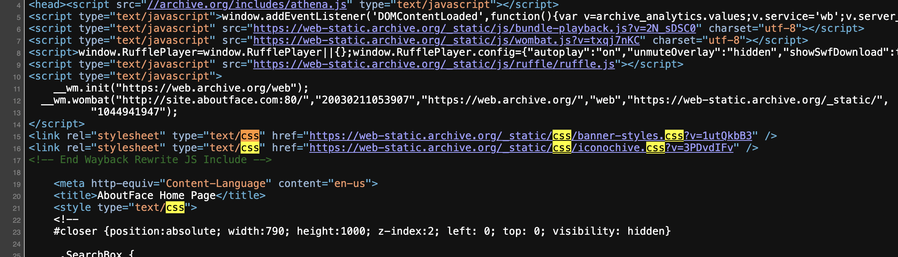
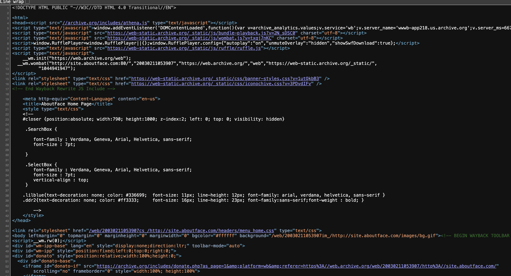
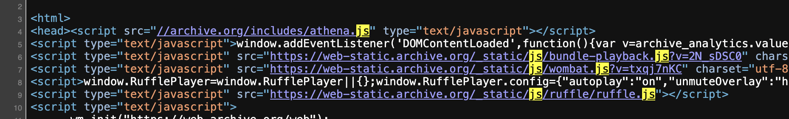

Assignment 1: Inspecting the Cultural Web

Source: https://web.archive.org/web/20030211053907/http://site.aboutface.com/
Name: AboutFace (Community & Colleague site in 2003) (Before Facebook)

What web technologies (that is HTML, CSS, or JavaScript) were used to build the tool? Are there files that end in .html, .css, or .js? What about files you don’t recognize? 

>Yes, HTML tags include: !DOCTYPE HTML PUBLIC "-//W3C//DTD HTML 4.0 Transitional//EN">, <head>, <body?>, 
, and more 
> Yes, CSS tags include: <style type="text/css"> 
> Yes, JavaScript 
tags include: <script>

Who built this website? How many people were involved? How can you tell?
Not clear, the webpage lists a company phone number: 617-975-3800 
Most likely a small group/company.

Screenshots:

